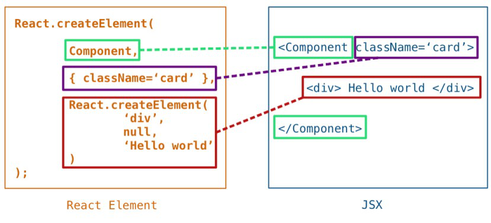
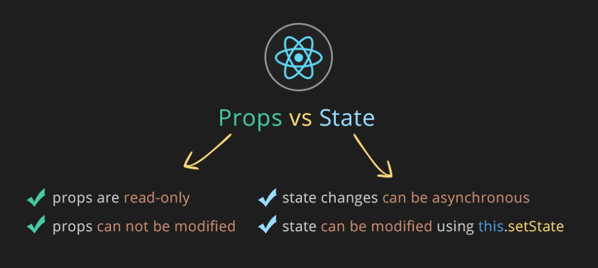

## ¿Cuál es el comando para instalar un módulo de nodo?


**Node Package Manager (npm)** es un administrador de paquetes de JavaScript que gestiona las dependencias en proyectos escritos en Node.js.

Con este administrador, puede administrar la instalación, actualización y eliminación de paquetes (bibliotecas). En términos generales, npm es el registro de
software más grande del mundo.

npm tiene tres componentes:

- Sitio web;
- interfaz de línea de comando (CLI);
- registro.

Desde el sitio web, puede encontrar paquetes, configurar perfiles y administrar otros aspectos de su experiencia npm. Por ejemplo, puede configurar una organi
zación para controlar el acceso a paquetes públicos o privados.

La interfaz de línea de comandos (CLI) se ejecuta en la terminal a través de la cual los desarrolladores interactúan con npm.

El registro es una gran base de datos pública con software JavaScript y metainformación que lo acompaña.

### ¿Para qué se utiliza el Node Package Manager?

Los desarrolladores de software de código abierto de todo el mundo utilizan npm para compartir y tomar prestados paquetes.

Con npm puedes:

- adapte paquetes de código a sus aplicaciones o utilícelos en su forma original;
- descargue herramientas sin conexión que pueda utilizar inmediatamente;
- ejecutar paquetes sin descargarlos;
- compartir código con cualquier usuario de npm, independientemente de su ubicación;
- limitar el acceso al código proporcionándolo únicamente a desarrolladores individuales;
- crear organizaciones para gestionar el mantenimiento de paquetes, la creación de códigos y la mano de obra de los desarrolladores;
- formar equipos virtuales utilizando organizaciones;
- gestionar versiones y dependencias de código;
- actualizar rápidamente las aplicaciones al actualizar el código subyacente;
- encontrar múltiples formas de resolver el mismo problema;
- Encuentre otros desarrolladores que estén trabajando en problemas y proyectos similares.

### Beneficios de usar npm

Existen muchos beneficios al usar npm al desarrollar proyectos de Node.js:

- Fácil de instalar. npm viene con Node.js, por lo que la instalación solo lleva unos minutos.
- Gestión de dependencia. npm simplifica la gestión de dependencias, lo cual es especialmente importante para proyectos con una gran cantidad de módulos. Cada paquete en npm es una colección de archivos y dependencias que puedes instalar y usar en tu proyecto.
- Soporte para paquetes de publicación. npm permite a los desarrolladores publicar sus paquetes, lo que les ayuda a compartir sus bibliotecas y módulos con otros desarrolladores de todo el mundo.
- Gran cantidad de paquetes disponibles. npm ofrece acceso a más de 1,5 millones de paquetes, lo que permite a los desarrolladores encontrar rápida y fácilmente los módulos y bibliotecas que necesitan. Con npm puedes instalar paquetes desde el repositorio central de npm o desde archivos locales.
- Control de versiones. npm controla automáticamente las versiones de los paquetes, lo que permite a los desarrolladores evitar conflictos entre las versiones de los módulos. Puede instalar una versión específica de un paquete o puede actualizar el paquete a la última versión. Esto garantiza que su proyecto sea compatible con todas las dependencias requeridas.
- Soporte de línea de comando. El uso de comandos CLI le permite automatizar la instalación y la gestión de dependencias.

El uso de npm facilita mucho el desarrollo de proyectos de Node.js, razón por la cual se ha convertido en uno de los administradores de paquetes más populares del mundo.

### Descripción general de cómo funciona npm

Para trabajar con npm necesitas instalar Node.js.

Para publicar paquetes en espacios de nombres, debe crear una cuenta en npmjs.com y configurar la autenticación de dos factores (opcional, pero recomendada).

Un paquete es un archivo o directorio descrito en el archivo **package.json** adjunto. Este archivo es necesario para publicar el paquete en el registro npm.

Echemos un vistazo más de cerca a los procesos de instalación y creación de paquetes.

#### Instalación de paquetes

Los paquetes se pueden instalar local o globalmente.

##### Instalación local

Instale el paquete localmente si su propio módulo depende de él, por ejemplo si está especificado en la función **require()**. Este es el comportamiento predeterminado de npm.

###### Instalación de un paquete desde el espacio de nombres global (paquete sin ámbito)

Los paquetes del espacio de nombres global siempre son públicos. Cualquier usuario puede encontrar dicho paquete, descargarlo e instalarlo.

Para instalar un paquete público, ejecute el siguiente comando en el directorio de su proyecto:

```Shell
npm install <package_name>
```

Se creará un directorio llamado **node_modules** en el directorio actual (si aún no se ha creado) y se descargará en él la versión más reciente del paquete.

###### Instalación de un paquete público desde un espacio de nombres específico (paquete público con alcance)

Cualquiera puede descargar e instalar un paquete público de un espacio de nombres específico si el nombre del espacio de nombres se especifica durante la instalación:

```Shell
npm install @scope/package-name
```

###### Instalar un paquete privado

Los paquetes privados (privados) solo pueden ser descargados por aquellos a quienes se les ha otorgado acceso de lectura a esos paquetes. Estos paquetes siempre pertenecen a un espacio de nombres y deben especificarse durante la instalación:

```Shell
npm install @scope/private-package-name
```

##### Instalación global

Para ejecutar paquetes globalmente, se recomienda utilizar npx, una utilidad para ejecutar paquetes npm.

Si un paquete está instalado globalmente, puede usar su código como un conjunto de herramientas en su computadora local.

Para descargar e instalar el paquete globalmente, ejecute el siguiente comando en el símbolo del sistema:

```Shell
npm install -g <package_name>
```

Si se produce un error de permisos de EACCES, es posible que deba reinstalar npm usando el administrador de versiones o cambiar manualmente el directorio predeterminado.

#### Colocación del paquete

Para colocar un paquete en el registro, necesita un archivo **package.json**, que contiene una descripción del paquete. Hace que el paquete sea fácil de instalar y administrar. En el archivo **package.json**:

- enumera los paquetes de los que depende su proyecto;
- especifica las versiones de paquetes que su proyecto puede usar;
- El diseño es reproducible para compartirlo fácilmente con otros desarrolladores.

Para facilitar la búsqueda, se recomienda utilizar un campo de _descripción_ personalizado en el archivo **package.json**.

El archivo package.json se puede crear de dos maneras: (1) respondiendo preguntas en la CLI o (2) creando un package.json predeterminado.

Para crear un archivo de la primera manera:

- En la línea de comando, vaya al directorio raíz de su módulo Node.js y ejecute **npm init**:

  - para un módulo con un espacio de nombres, ejecute **npm init --scope=@scope-name**;
  - Para un módulo en el espacio de nombres global, ejecute **npm init**.

- Especifique valores para los campos obligatorios (**name** y **version**), así como el campo **main**:
  - **name**: nombre del módulo.
  - **version**: versión inicial del módulo.
  - **main**: un identificador de módulo que sirve como punto de entrada principal a su programa. Si no se establece este valor, el valor predeterminado es el archivo index.js en la raíz del paquete.

Para crear un archivo package.json predeterminado, ejecute **npm init --yes**.

Los campos **name** y **version** son obligatorios, independientemente de cómo cree el archivo **package.json**:

- El campo **name** contiene el nombre del paquete. El nombre debe ser una palabra y puede contener caracteres en minúscula, guión y guión bajo.
- El valor en el campo **version** debe cumplir con las pautas de control de versiones semánticas. Se indican tres números mediante un punto: la versión principal actual, la versión menor actual y los cambios menores. Por ejemplo, 1.1.0.

Si desea proporcionar información sobre el autor de un paquete, utilice el siguiente formato:

```
My name my@email.com (http://website.com)
```

Todo el código para crear e inicializar el archivo **package.json** podría verse así:

```json
{
  "name": "my-cool-package",
  "version": "1.0.0",
  "author": My name my@email.com (http://website.com)
}
```

#### Archivo para cargar un módulo usando require()

La función **require()** es una función de Node.js para cargar módulos. Sus argumentos incluyen el nombre del módulo que necesitamos.

**require()** puede ser útil si queremos utilizar un módulo de terceros en nuestro paquete. Para crear un archivo **package.json** usando esta función, declar
arlo como una propiedad del objeto **exports**. Esto le dará acceso al código de terceros:

```
exports.logMsg = function() {
  console.log("Hello!");
}
```

#### Crear y publicar un paquete público en el espacio de nombres global

- en la línea de comando, cree un directorio de paquetes;
- vaya al directorio del paquete;
- en el directorio raíz del paquete, ejecute el comando **npm init**;
- responda las preguntas para crear un archivo **package.json**;
- cree un archivo README que describa el código y las instrucciones para usarlo;
- crear código de paquete;
- revise el paquete en busca de información confidencial y retírelo si está presente;
- pruebe el paquete especificando la ruta completa a su directorio: **npm install path/to/my-package**;
- Publique el paquete ejecutando el comando **npm publish** desde el directorio raíz del paquete;
- Para ver un paquete publicado, vaya a *https://npmjs.com/package/package-name* y reemplace _package-name_ con el nombre de su paquete.

> ¡Importante! No incluya información confidencial en los paquetes.

#### Crear y publicar un paquete público en un espacio de nombres específico

Para publicar un paquete npm en un espacio de nombres personalizado, cree una cuenta **npm**. O, para publicar un paquete en el espacio de nombres de una organización, después de crear una cuenta, cree una organización.

- si usa npmrc para administrar cuentas, cambie al perfil deseado con el comando **npmrc <profile-name>**;
- en la línea de comando, cree un directorio de paquetes;
- vaya al directorio del paquete;
- En el directorio raíz del paquete, ejecute uno de los siguientes comandos:
  - para un paquete en el espacio de nombres de la organización (reemplace my-org con el nombre de la organización): **npm init --scope=@my-org**;
  - para un paquete en el espacio de nombres de usuario (reemplace mi-nombre de usuario con el nombre de usuario): **npm init --scope=@my-username**.
- responda las preguntas para crear un archivo **package.json**;
- cree un archivo README que describa el código y las instrucciones para usarlo;
- crear código de paquete;
- revise el paquete en busca de información confidencial y retírelo si está presente;
- pruebe el paquete especificando la ruta completa a su directorio: **npm install path/to/my-package**;
- publique el paquete ejecutando el comando **npm publish --access public** desde el directorio raíz del paquete;
- Para ver un paquete publicado, vaya a **https://npmjs.com/package/package-name**, reemplazando **package-name** con el nombre de su paquete.

### Conclusión

npm es una herramienta importante e imprescindible para desarrollar proyectos Node.js. Debido al hecho de que el repositorio npm contiene una gran cantidad de paquetes, los desarrolladores pueden agregar funcionalidad a sus proyectos de manera rápida y conveniente utilizando módulos y bibliotecas ya preparados.

Una de las principales ventajas de npm es la facilidad de instalación y gestión de dependencias. Con el comando npm install, puede instalar rápidamente todoslos paquetes necesarios para un proyecto y, con la administración de dependencias, npm instala y actualiza automáticamente las dependencias de los paquetes.

Además, npm proporciona capacidades de publicación de paquetes, lo que permite a los desarrolladores compartir sus módulos y bibliotecas con otros desarrolladores de todo el mundo. De esta manera, puedes crear proyectos mejores y más eficientes a través de la interacción y colaboración entre desarrolladores.

---

---

## ¿Cuáles son los dos tipos de componentes de React?


¿En qué se diferencian los componentes funcionales de React de los componentes basados en clases? Desde hace bastante tiempo, la respuesta tradicional a esta pregunta es: «La aplicación de las clases permite aprovechar más las posibilidades de los componentes, por ejemplo, el estado». Ahora, con la aparición de los hooks, esta respuesta ya no refleja la verdadera situación.

Puede que haya oído hablar de que uno de estos tipos de componentes tiene un mejor rendimiento que el otro. ¿Pero cuál? La mayoría de los puntos de referencia con los que se verifica esto tienen deficiencias, por lo que sacaría conclusiones en base a sus resultados, con mucho cuidado. El rendimiento depende básicamente de lo que ocurra en el código, no de si se seleccionan componentes funcionales o componentes basados en clases para implementar ciertas capacidades. Nuestro estudio encontró que la diferencia de rendimiento entre los diferentes tipos de componentes es insignificante. Sin embargo, hay que señalar que las estrategias de optimización aplicadas a la hora de trabajar con ellos varían ligeramente.

### ¿Cuáles son las características del código de componentes basado en funciones y clases?

Considere este componente:

```JavaScript
function ProfilePage(props) {
  const showMessage = () => {
    alert('Followed ' + props.user);
  };

  const handleClick = () => {
    setTimeout(showMessage, 3000);
  };

  return (
    <button onClick={handleClick}>Follow</button>
  );
}
```

Muestra un botón en el que se hace clic para simular, mediante la función setTimeout, la ejecución de una consulta de red y, a continuación, muestra una ventana de mensaje que confirma la ejecución de la operación. Por ejemplo, si en props.user se almacena 'Dan', en la ventana del mensaje, después de tres segundos, aparecerá 'Followed Dan'.

Tenga en cuenta que no importa si se utilizan funciones de flecha o anuncios de funciones. El diseño de la vista function handleClick () funcionará exactamente igual.

¿Cómo puedo reescribir este componente como una clase? Si simplemente rehace el código que acaba de revisar convirtiéndolo en un código de componente basado en la clase, resulta lo siguiente:

```JavaScript
class ProfilePage extends React.Component {
  showMessage = () => {
    alert('Followed ' + this.props.user);
  };

  handleClick = () => {
    setTimeout(this.showMessage, 3000);
  };

  render() {
    return <button onClick={this.handleClick}>Follow</button>;
  }
}
```

Se acepta generalmente que dos fragmentos de código similares son equivalentes. Y los desarrolladores suelen ser completamente libres, en el curso de la refactorización del código, para convertir una cosa en otra sin pensar en las posibles consecuencias.


Sin embargo, hay una pequeña diferencia entre estos fragmentos de código. Mira más de cerca. ¿Ves la diferencia? Por ejemplo, no la vi de inmediato.

A continuación vamos a considerar esta diferencia, así que aquí, para aquellos que quieren entender la esencia de lo que está sucediendo, un ejemplo de trabajo de este código. (https://codesandbox.io/s/pjqnl16lm7)

Antes de continuar, me gustaría hacer hincapié en que la diferencia en cuestión no tiene nada que ver con los Hooks React. En ejemplos anteriores, por cierto, los hooks ni siquiera se utilizan. Se trata de la diferencia entre las funciones y las clases en React. Y si usted está planeando utilizar muchos componentes funcionales en sus aplicaciones React, entonces usted puede querer entender esta diferencia.

De hecho, la diferencia entre las funciones y las clases se ilustra con el ejemplo de error que se encuentra a menudo en las aplicaciones de React.

### Un error que se encuentra con frecuencia en las aplicaciones React

Abra la página de ejemplo que muestra la lista que permite seleccionar perfiles de usuario y los dos botones de seguimiento que muestran los componentes ProfilePageFunction y ProfilePageClass, funcionales y basados en la clase, cuyo código se muestra más arriba. (https://codesandbox.io/s/pjqnl16lm7)

Intente, para cada uno de estos botones, realizar la siguiente secuencia de acciones:

1. Haga clic en el botón.
2. Cambie el perfil seleccionado antes de pasar 3 segundos después de hacer clic en el botón.
3. Lea el texto que aparece en la ventana del mensaje.

Una vez hecho esto, notará las siguientes características:

- Al hacer clic en un botón formado por un componente funcional, con el perfil Dan seleccionado y al cambiar posteriormente al perfil Sophie, se mostrará 'Seguir dando' en la ventana del mensaje.
- Si se hace lo mismo con un botón formado por un componente basado en clase, se deducirá 'Followed Sophie'.


En este ejemplo, el comportamiento del componente funcional es correcto. Si me suscribí a un perfil de alguien y luego pasé a otro perfil, mi componente no debe dudar de cuál es el perfil al que me inscribí. Obviamente, la implementación del mecanismo en cuestión, basada en el uso de clases, contiene un error.

### Causas del mal comportamiento del componente basado en la clase

¿Por qué un componente basado en clase se comporta así? Para entender esto, echemos un vistazo al método showMessage en nuestra clase:

```JavaScript
class ProfilePage extends React.Component {
  showMessage = () => {
    alert('Followed ' + this.props.user);
  };
```

Este método lee los datos de this.props.user. Las propiedades de React son inmutables, por lo que no cambian. Sin embargo, esta, como siempre ha sido, es una entidad mutable.

De hecho, el objetivo de tener esto en la clase radica en la posibilidad de que esto cambie. La propia biblioteca React realiza periódicamente mutaciones de esta, lo que permite trabajar con versiones recientes del método render y los métodos del ciclo de vida del componente.

Como resultado, si nuestro componente vuelve a renderizar durante la ejecución de la consulta, cambiará this.props. Después de esto, el método showMessage leerá el valor del usuario desde una entidad «demasiado nueva».

Esto le permite hacer una observación interesante sobre las interfaces de usuario. Si se dice que la interfaz de usuario, conceptualmente, es una función del estado actual de la aplicación, los controladores de eventos forman parte de los resultados de renderizado, al igual que los resultados de renderizado visibles. Nuestros manejadores de eventos «pertenecen» a una operación de renderizado específica junto con propiedades y estado específicos.

Sin embargo, la planificación del tiempo de espera, cuyo collback lee this.props, rompe esta conexión. El collback showMessage no está «vinculado» a ninguna operación de renderizado en particular, como resultado, «pierde» las propiedades correctas. La lectura de datos de esta relación rompe.

---

---

## ¿Por qué usamos props en React?


Los componentes React utilizan props para interactuar entre sí. Cada componente padre puede pasar algo de información a sus componentes hijos, pasándoles los parámetros. Los parámetros pueden recordarle los atributos HTML, pero a través de ellos puede pasar cualquier valor de JavaScript, incluidos objetos, arreglos y funciones.

### Opciones conocidas

Los parámetros son la información que pasa a la etiqueta JSX. Por ejemplo, className, src, alt, width y height son algunos de los parámetros que puede pasar a la etiqueta < img >:

```JavaScript
function Avatar() {
    return (
        
    );
}

export default function Profile() {
    return <Avatar />;
}
```

Los parámetros que puede pasar a la etiqueta < img > están predefinidos (ReactDOM cumple con el estándar HTML). Pero puede pasar cualquier configuración a sus componentes, como < Avatar >, para configurarlos. Así es como!

### Transferencia de parámetros a un componente

En este código, el componente Perfil no pasa ningún parámetro a su hijo Avatar:

```JavaScript
export default function Profile() {
    return <Avatar />;
}
```

Puede pasar a Avatar algunos parámetros en dos etapas.

#### Paso 1: Pase los parámetros al componente secundario

Primero pase a Avatar algunos parámetros. Por ejemplo, pasaremos dos parámetros: persona (objeto) y tamaño (número):

```JavaScript
export default function Profile() {
    return (
        <Avatar
            person={{
                name: 'Lin Lanying',
                imageId: '1bX5QH6',
            }}
            size={100}
        />
    );
}
```

Ahora puede leer estos parámetros dentro del componente Avatar.

#### Paso 2: Leer parámetros dentro del componente secundario

Puede leer estos parámetros enumerando sus nombres de persona, tamaño, separados por comas dentro ({y}) inmediatamente después de la función Avatar. Esto le permitirá usarlos dentro del código de Avatar como lo haría con una variable.

```JavaScript
function Avatar({ person, size }) {
    // person and size are available here
}
```

Agregue a Avatar una lógica que utilice los parámetros person y Size para renderizar, y todo está listo.

Ahora puede configurar Avatar para renderizar de varias maneras con diferentes parámetros. ¡Intente ajustar los valores!

```JavaScript
# utils.js
export function getImageUrl(person, size = 's') {
    return (
        'https://i.imgur.com/' +
        person.imageId +
        size +
        '.jpg'
    );
}
```

```JavaScript
import { getImageUrl } from './utils.js';

function Avatar({ person, size }) {
    return (
        
    );
}

export default function Profile() {
    return (
        <div>
            <Avatar
                size={100}
                person={{
                    name: 'Katsuko Saruhashi',
                    imageId: 'YfeOqp2',
                }}
            />
            <Avatar
                size={80}
                person={{
                    name: 'Aklilu Lemma',
                    imageId: 'OKS67lh',
                }}
            />
            <Avatar
                size={50}
                person={{
                    name: 'Lin Lanying',
                    imageId: '1bX5QH6',
                }}
            />
        </div>
    );
}
```

Las opciones le permiten pensar en los componentes padre e hijo de forma independiente. Por ejemplo, puede cambiar la configuración de persona o tamaño dentro de Perfil sin tener que pensar en cómo Avatar los usa. Del mismo modo, puede cambiar la forma en que Avatar utiliza estos parámetros sin buscar en Perfil.

Puedes pensar en los parámetros como «plumas» que se pueden ajustar. Cumplen la misma función que los argumentos para las funciones - ¡de hecho, el parámetro es el único argumento de su componente! Las funciones de los componentes React aceptan un único argumento: el objeto props:

```JavaScript
function Avatar(props) {
    let person = props.person;
    let size = props.size;
    // ...
}
```

Normalmente no necesita todo el objeto props, por lo que lo desestructurará en parámetros separados.

#### Especificar el valor predeterminado para el parámetro

Si desea establecer un valor predeterminado para un parámetro cuando no se especifica ningún valor, puede hacerlo mediante la desestructuración colocando = y el valor predeterminado inmediatamente después del parámetro:

```JavaScript
function Avatar({ person, size = 100 }) {
    // ...
}
```

Ahora, si < Avatar person = {... }/> aparece sin la propiedad size, entonces size se establecerá en 100.

El valor predeterminado sólo se utiliza si falta el parámetro size o si se pasa size = {undefined}. Pero si pasa size = {null} o size = {0}, no se utilizará el valor predeterminado.

#### Reenviar parámetros con sintaxis JSX spread

A veces la transferencia de parámetros se vuelve muy repetitiva:

```JavaScript
function Profile({ person, size, isSepia, thickBorder }) {
    return (
        <div className="card">
            <Avatar
                person={person}
                size={size}
                isSepia={isSepia}
                thickBorder={thickBorder}
            />
        </div>
    );
}
```

No hay nada malo en el código repetitivo - puede ser más legible. Pero a veces puede ser importante para ti la brevedad. Algunos componentes pasan todos sus parámetros a sus componentes secundarios, por ejemplo, cómo lo hace este Perfil con Avatar. Como no utilizan parámetros directamente, tiene sentido utilizar una sintaxis de espray más concisa:

```JavaScript
function Profile(props) {
    return (
        <div className="card">
            <Avatar {...props} />
        </div>
    );
}
```

Esto reenvía todos los parámetros de Perfil a Avatar sin enumerar los nombres de cada uno.

Utilice la sintaxis de propagación de forma discreta. Si lo usas en cada segundo componente, algo está mal. A menudo, esto indica que debe dividir sus componentes y pasar los componentes secundarios como JSX. ¡Más información sobre esto!

---

---

## ¿Qué es JSX?


### JSX - Detalles

Fundamentalmente, JSX es un azúcar sintáctico para la función:

```JavaScript
React.createElement(component, props, ...children)
```

Código JSX:

```JSX
<MyButton color="blue" shadowSize={2}>
  Click Me
</MyButton>
```

compilada en:

```JavaScript
React.createElement(
  MyButton,
  {color: 'blue', shadowSize: 2},
  'Click Me'
)
```

También puede utilizar un formulario de auto-cierre para etiquetas que no tengan descendientes. Por ejemplo:

```JSX
<div className="sidebar" />
```

compilada en:

```JavaScript
React.createElement(
  'div',
  {className: 'sidebar'},
  null
)
```

Puede probar cómo se compilan diferentes diseños JSX en JavaScript en el compilador en línea de Babel. (https://babeljs.io/)



### Especificación de los tipos de elementos React

La parte inicial de la etiqueta JSX especifica el tipo de elemento React.

Los tipos definidos desde Mayúsculas indican que la etiqueta hace referencia a un componente React. Estas etiquetas, durante el proceso de compilación, hacen referencia a una variable con nombre que contiene el componente React. Por lo tanto, tenga en cuenta: esta variable debe estar en el ámbito de la visibilidad. Por ejemplo: Si utiliza la expresión JSX - < Foo/>, la variable Foo debe estar en el área de visibilidad.

#### React debe estar en el ámbito de visibilidad

Debido a que JSX se compila en las llamadas a la función React.createElement, la librería React siempre debe estar en el área de visibilidad de su código JSX.

Por ejemplo: ambas líneas de importación son necesarias en este código, ya que React y CustomButton no se incluyen directamente en JavaScript:

```JavaScript
import React from 'react';
import CustomButton from './CustomButton';

function WarningButton() {
  // return React.createElement(CustomButton, {color: 'red'}, null);
  return <CustomButton color="red" />;
}
```

Si no utiliza ningún empaquetador de JavaScript y agrega Aprox directamente a la etiqueta < script >, React siempre estará en el ámbito de visibilidad global.

#### Uso de notación por punto en tipo JSX

Se puede hacer referencia a un componente React utilizando una notación a través de un punto en JSX. Esto es conveniente si usted tiene un módulo que exporta varios componentes React. Por ejemplo, si MyComponents.DatePicker es un componente, puede utilizar esta notación directamente en JSX:

```JavaScript
import React from 'react';

const MyComponents = {
  DatePicker: function DatePicker(props) {
    return <div>Imagine a {props.color} datepicker here.</div>;
  }
}

function BlueDatePicker() {
  return <MyComponents.DatePicker color="blue" />;
}
```

##### Los componentes recién definidos que no formen parte de la biblioteca estándar de React deben denominarse con letra mayúscula

---

---

## ¿Qué es el estado?


### Estado: memoria del componente

Los componentes a menudo deben cambiar lo que aparece en la pantalla como resultado de la interacción. La entrada de texto en el formulario debe actualizar el campo de entrada, al hacer clic en el botón «siguiente» en el carrusel de imágenes debe cambiar la imagen mostrada, al hacer clic en el botón «comprar» debe colocar el artículo en la cesta. Los componentes deben «recordar» las cosas: el valor de entrada actual, la imagen actual, la papelera de reciclaje. Este tipo de memoria específica de componentes se denomina estado (state).

#### Cuando la variable normal no es suficiente

Aquí está el componente que muestra la imagen de la escultura. Haciendo clic en el botón «Siguiente» debe mostrar la siguiente escultura, cambiando el índice a 1, luego 2 y así sucesivamente. Sin embargo, no funciona (¡puedes intentarlo!):

```JavaScript
import { sculptureList } from './data.js';

export default function Gallery() {
    let index = 0;

    function handleClick() {
        index = index + 1;
    }

    let sculpture = sculptureList[index];
    return (
        <>
            <button onClick={handleClick}>Next</button>
            <h2>
                <i>{sculpture.name} </i>
                by {sculpture.artist}
            </h2>
            <h3>
                ({index + 1} of {sculptureList.length})
            </h3>
            
            <p>{sculpture.description}</p>
        </>
    );
}
```

El controlador de eventos handleClick actualiza la variable de índice local. Pero dos cosas no permiten ver este cambio:

1. Las variables locales no se guardan entre renders. Cuando Nat renderiza este componente por segunda vez, lo renderiza desde cero - no tiene en cuenta ningún cambio en las variables locales.
2. Los cambios en las variables locales no causan renderización. Nat no entiende que necesite volver a renderizar un componente con nuevos datos.

Para actualizar un componente con nuevos datos, deben ocurrir dos cosas:

1. Guardar datos entre renders.
2. El desencadenador Nat para renderizar un componente con datos nuevos (re-renderizado).

Hook useState proporciona estas dos cosas:

1. Variable state para guardar datos entre renders.
2. La función state setter para actualizar la variable y ejecutar Nat para volver a renderizar el componente.

#### Agregar variable de estado



Para agregar una variable de estado, importe useState desde Nat en la parte superior del archivo:

```JavaScript
import { useState } from 'react';
```

A continuación, reemplace esta línea:

```JavaScript
let index = 0;
```

Con

```JavaScript
const [index, setIndex] = useState(0);
```

index es una variable de estado y setIndex es una función instaladora.

Así es como trabajan juntos en handleClick:

```JavaScript
function handleClick() {
    setIndex(index + 1);
}
```

Ahora haga clic en Siguiente para cambiar la escultura actual:

```JavaScript
import { useState } from 'react';
import { sculptureList } from './data.js';

export default function Gallery() {
    const [index, setIndex] = useState(0);

    function handleClick() {
        setIndex(index + 1);
    }

    let sculpture = sculptureList[index];
    return (
        <>
            <button onClick={handleClick}>Next</button>
            <h2>
                <i>{sculpture.name} </i>
                by {sculpture.artist}
            </h2>
            <h3>
                ({index + 1} of {sculptureList.length})
            </h3>
            
            <p>{sculpture.description}</p>
        </>
    );
}
```

#### Conoce tu primer gancho

En Nat, la función useState, como cualquier otra función que comienza con «use», se llama hook.

Los hooks son funciones especiales que sólo están disponibles durante el renderizado (que veremos con más detalle en la página siguiente). Le permiten «conectarse» a las diferentes funciones de Nat.

La fortuna es sólo una de estas funciones, pero los otros hooks se conocerán más tarde.

#### Anatomía de useState

Cuando llamas a useState, le dices a Nat que quieres que este componente recuerde algo:

```JavaScript
const [index, setIndex] = useState(0);
```

En este caso, desea que Nat recuerde el índice.

El único argumento para useState es el valor inicial de su variable de estado. En este ejemplo, el valor inicial del índice se establece en 0 mediante useState (0).

Con cada renderizado de un componente, useState produce una matriz que contiene dos valores:

1. Variable state (índice) con el valor que ha guardado.
2. Función de configuración de estado (setIndex) que puede actualizar la variable de estado y llamar a Nat para volver a renderizar el componente.

Así es como sucede en la acción:

1. Dado que ha pasado 0 a useState como valor inicial para el índice, se devolverá [0, setIndex]. Nat recuerda que 0 es el último valor del estado.
2. Está actualizando el estado. Cuando el usuario hace clic en un botón, se llama a setIndex (index + 1). el índice es 0, por lo que se llama a setIndex (1). Esto indica a Nat que el índice es ahora 1 y llama a otro render.
3. El segundo render de su componente. Aprox todavía ve useState (0), pero como Nat recuerda que ha establecido el índice en 1, devuelve [1, setIndex] en su lugar.
4. ¡Y así sucesivamente!

#### Estado aislado y privado

El estado es local para la instancia del componente en pantalla. En otras palabras, si muestra el mismo componente dos veces, cada copia tendrá un estado completamente aislado. Cambiar uno de ellos no afectará al otro.

En este ejemplo, el componente Gallery utilizado anteriormente aparece dos veces sin cambios en la lógica. Trate de hacer clic en los botones dentro de cada una de las galerías. Tenga en cuenta que su estado es independiente:

```JavaScript
import Gallery from './Gallery.js';

export default function Page() {
    return (
        <div className="Page">
            <Gallery />
            <Gallery />
        </div>
    );
}
```

Esto es lo que diferencia el estado de las variables normales que puede declarar en la parte superior de su módulo. El estado no está vinculado a una llamada específica a una función o lugar en el código, es «local» para un lugar específico en la pantalla. Ha mostrado dos componentes < Gallery/>, por lo que su estado se almacena por separado.

También tenga en cuenta que el componente Page no «sabe» nada sobre el estado de Gallery e incluso si lo tiene. A diferencia de los props, el estado es totalmente privado para el componente que lo declara. El componente padre no puede modificarlo. Esto le permite agregar un estado a cualquier componente o eliminarlo sin afectar al resto de componentes.

¿Y si quieres que ambas galerías sincronicen sus estados? La forma correcta de hacer esto es eliminar el estado de los componentes secundarios y agregarlo a su componente padre compartido más cercano.

---

---

## ¿Con qué tipo de componente usamos un constructor?


El constructor es un método utilizado para inicializar el estado de un objeto en una clase. Se llama automáticamente durante la creación de un objeto en una clase.

El concepto de constructor es el mismo en React. Se llama al constructor de un componente React antes de montar el componente. Cuando implementa el constructor para un componente React, debe llamar al método super (props) antes de cualquier otra instrucción. Si no llama al método super (props), esto.props no estará definido en el constructor y puede provocar errores.

```JavaScript
Constructor(props){
     super(props);
}
```

En React, los constructores se utilizan principalmente para dos propósitos:

1. Se utiliza para inicializar el estado local del componente asignando un objeto a this.state.
2. Se utiliza para enlazar los métodos de controlador de eventos que se producen en el componente.

No se puede llamar al método setState () directamente en el constructor (). Si el componente necesita usar el estado local, necesita usar directamente 'this.state' para asignar el estado inicial en el constructor. El constructor sólo utiliza esto.state para asignar el estado inicial y todos los demás métodos deben utilizar el método set.state ().

### Ejemplo

El concepto del constructor puede entenderse a partir del siguiente ejemplo.

#### App.js

```JavaScript
import React, { Component } from 'react';

class App extends Component {
  constructor(props){
    super(props);
    this.state = {
         data: 'www.javatpoint.com'
      }
    this.handleEvent = this.handleEvent.bind(this);
  }
  handleEvent(){
    console.log(this.props);
  }
  render() {
    return (
      <div className="App">
	<h2>React Constructor Example</h2>
	<input type ="text" value={this.state.data} />
        <button onClick={this.handleEvent}>Please Click</button>
      </div>
    );
  }
}
export default App;
```

#### Main.js

```JavaScript
import React from 'react';
import ReactDOM from 'react-dom';
import App from './App.js';

ReactDOM.render(<App />, document.getElementById('app'));
```

### Salida

Cuando ejecuta el código anterior, obtiene la siguiente salida.


Las preguntas más comunes relacionadas con el constructor son:

#### 1. ¿Es necesario tener un constructor en cada componente?

No, no es necesario tener un constructor en cada componente. Si el componente no es complejo, simplemente devuelve un nodo.

```JavaScript
class App extends Component {
    render () {
        return (
            <p> Name: { this.props.name }</p>
        );
    }
}
```

#### 2. ¿Es necesario llamar a super () dentro de un constructor?

Sí, es necesario llamar a super () dentro de un constructor. Si necesita establecer una propiedad o acceder a 'esto' dentro del constructor en su componente, debe llamar a super ().

```JavaScript
class App extends Component {
    constructor(props){
        this.fName = "Jhon"; // 'this' is not allowed before super()
    }
    render () {
        return (
            <p> Name: { this.props.name }</p>
        );
    }
}
```

Cuando se ejecuta el código anterior, se obtiene un error diciendo 'esto' no está permitido antes de super (). Entonces, si necesita acceder a los apoyos dentro del constructor, debe llamar a super (apoyos).

### Funciones de flecha

La función Flecha es la nueva característica del estándar ES6. Si necesita usar funciones de flecha, no es necesario enlazar ningún evento a «esto». Aquí, el alcance de «esto» es global y no se limita a ninguna función de llamada. Así que si usted está utilizando la función de flecha, no hay necesidad de enlazar 'esto' dentro del constructor.

```JavaScript
import React, { Component } from 'react';

class App extends Component {
  constructor(props){
    super(props);
    this.state = {
         data: 'www.javatpoint.com'
      }
  }
  handleEvent = () => {
    console.log(this.props);
  }
  render() {
    return (
      <div className="App">
	<h2>React Constructor Example</h2>
	<input type ="text" value={this.state.data} />
        <button onClick={this.handleEvent}>Please Click</button>
      </div>
    );
  }
}
export default App;
```

Podemos usar un constructor de las siguientes maneras:

#### 1. El constructor se utiliza para inicializar el estado.

```JavaScript
class App extends Component {
  constructor(props){
        // here, it is setting initial value for 'inputTextValue'
        this.state = {
            inputTextValue: 'initial value',
        };
  }
}
```

#### 2. Usando 'este' constructor interior

```JavaScript
class App extends Component {
    constructor(props) {
        // when you use 'this' in constructor, super() needs to be called first
        super();
        // it means, when you want to use 'this.props' in constructor, call it as below
        super(props);
    }
}
```

#### 3. Inicialización de bibliotecas de terceros

```JavaScript
class App extends Component {
    constructor(props) {

        this.myBook = new MyBookLibrary();

        //Here, you can access props without using 'this'
        this.Book2 = new MyBookLibrary(props.environment);
    }
}
```

#### 4. Enlazar algún contexto (este) cuando necesite que un método de clase se pase en apoyos a los niños.

```JavaScript
class App extends Component {
    constructor(props) {

        // when you need to 'bind' context to a function
        this.handleFunction = this.handleFunction.bind(this);
    }
}
```
